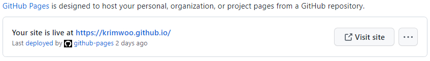

# readme

November 29, 2022

---

## 1. 기본 Github 페이지 만들기

- <**[KRimwoo.github.io](https://github.com/KRimwoo/KRimwoo.github.io)**> repositiry 생성 후 , PC의 local repository에 연결하기
    
     기본환경은 window에서 powershell을 이용했다. (Git 설치도 완료)
    

<aside>
👉 Github에서 <username>.github.io 이름으로 repository를 생성한다. (이 때 repository는 전체공개 public 이어야 한다!) 그리고 이 repository의 주소를 복사한 후, PC에서 관리할 local directory에 git clone <주소> 명령어를 통해 연동해 준다.

</aside>

- 테스트 용 index.html 생성

<aside>
👉 이후에 페이지가 잘 생성되었는지 확인하기 위해 임시 index 페이지를 만들어 보았다. (파일은 local directory에 추가해준 후 git add .  → git commit -m “add: index.html” → git push 를 해주었다.)

```html
<!DOCTYPE html>
<html>
    <head>
        <title>Github Page Test</title>
    </head>
    <body>
        <h2>This is test page.</h2>
        <p>이 페이지가 잘 보인다면 성공!</p>
    </body>
</html>
```

</aside>

- git push 토큰 이용하기

<aside>
👉 이 때, git push  명령어를 사용하려면 접근 권한 토큰(PAT)이 필요하다!

<aside>
💡 깃허브 프로필 클릭 >> Setting >> Developer Setting >> Personal Access Token(classic) >> Generate new token >> 유효기간 체크, 권한 범위 체크 >> 생성 >> 토큰 복사 >> shell에서 git push를 요청했을 때 요구하는 password에 붙여넣기

</aside>

</aside>

- GitHub 페이지 시작하기

<aside>
👉 repository setting >> pages 로 이동하면 index.html이 적용된 page주소를 확인할 수 있다.



</aside>

---

## 2. Jekyll 적용하기

- Jekyll 설치

<aside>
👉 Jekyll을 설치하려면 먼저 루비가 설치되어있어야 한다. [https://rubyinstaller.org/downloads/](https://rubyinstaller.org/downloads/) 링크를 통해 다운받고 환경변수도 설정해준다.

- `gem install jekyll bundler` 을 통해 jekyll을 설치한다.
- `jekyll -v` 명령을 통해 잘 설치되었는지 확인할 수 있다.
</aside>

- local directory 에서 Jekyll 시작하기

<aside>
👉 repository의 local directory에서 `jekyll new . --force` 를 실행하면 jekyll 페이지를 만들 수 있는 기본 요소들이 설치된다. (전에 만들어둔 index.html은 삭제할 것!)

</aside>

- 임시 포스트 작성하기

<aside>
👉 post 형식을 잘 맞춘 markdown 파일을 하나 작성해 준다. 나는 markdown  기본 문법을 작성한 post를 하나 준비했다. 그리고 “_post”폴더에 넣어주면 된다.

</aside>

- local host 주소로 생성된 페이지 확인하기

<aside>
👉 위 항목을 완료한 뒤 git add, commit, push를 해주고, `bundle exec jekyll serve` 를 실행하면 [localhost:4000](http://localhost:4000) 으로 접속했을 때 기본 jekyll 형식의 블로그에 내가 만든 post가 올라간 것을 확인할 수 있다.

</aside>

---

## 3. 사용자화

(수정된 모든사항은 올바르게 add, commit, push 해준다.)

- Jekyll 테마 적용하기 (Hydejack theme 사용)

<aside>
👉 [http://jekyllthemes.org/](http://jekyllthemes.org/) 등의 사이트에서 블로그에 어울릴만한 테마를 골라준다.

예시) “Hydejack” theme


[https://github.com/hydecorp/hydejack-starter-kit](https://github.com/hydecorp/hydejack-starter-kit)

github에 올라와 있는 테마의 repository를 local에 clone 해온다. 그리고 내 블로그 local repository에 덮어쓰기로 복사한다. `bundle exec jekyll serve` 를 실행하면[localhost:4000](http://localhost:4000) 에서 테마의 기본 페이지를 확인할 수 있다. 

</aside>

- _config.yml 을 통해 Profile, Menu 등 수정

<aside>
👉 _config.yml 을 열어 url, title, author name, email 등을 맞게 수정해준다.

```yaml
url:                   https://KRimwoo.github.io

# The title of your blog. Used in the sidebar and the browser tab.
title:                 WooRim's Blog

# This should be the same author as first entry in `_data/authors.yml`.
author:
  # Used by `jekyll-feed`:
  name:                WooRim Kim
  email:               wrkim0525@gmail.com
```

추가로 `_data/authors.yml` 를 열어 블로그 작성자의 소개 글을 수정할 수도 있다.

Menu bar도 필요에 맞게 수정해준다.

```yaml
# Add links to the sidebar.
menu:
  - title:             Posts
    url:               /example/
```

기존에 작성한 post는 /example/_posts 에 넣어주었다.

(해당 menu에 대한 소개는 /_featured_categories/example.md 에서 수정한다.)

```yaml
# (Optional) Write a short (~150 characters) description of this featured tag.
description: >
  These are my very first posts!
```

+추가로 Hydejack theme의 적용 사항을 github.io 페이지에서 확인할 수 없다면 github repository 의 action 항목에서 페이지 빌드 현황을 확인할 수 있다. 빌드에 실패했다는 메세지를 확인했다면 _config.yml 의 마지막줄에서 remote_theme 영역을 uncomment해주면 된다.

</aside>

- 로고, favicon 바꾸기

<aside>
👉 블로그 메인에 위치한 로고를 바꾸고 싶다면 원하는 로고를 png파일로 만든 다음, assets/img 폴더에 넣어주고 _config.yml 파일에서 logo영역을 수정해 주면 된다.


```yaml
# A (square) logo for your site.
# If provided, it will be shown at the top of the sidebar.
# It also used by the `jekyll-seo-tag` plugin.
logo:                  /assets/img/woorim.png
```

favicon의 경우assets/ 폴더에 icon폴더가 없다면 생성해주고, 맘에 드는  favicon을 다운 받아 favicon.ico 이름으로 넣어주면 자동으로 적용된다.


</aside>

- 댓글 기능 추가

<aside>
👉 [https://disqus.com/](https://disqus.com/) 에서 회원가입을 진행하고 “I want to install Disqus on my site”를 선택한다. >> Create a new site 를 진행하고 website name을 설정해준다.  >> Platform은 Jekyll을 선택해준다.  >> Install Instruction확인 >> Configure단계에서 website name은 동일하게,  URL에 github.io 주소를 입력해준다.  >>  Complete setup

이후에 _config.yml 파일에서 post의 comment 영역을 찾아 true로 바꾸어주고, comment setting 의 <username>영역에 disqus 입력했던 website name을 적용해주고 조금 기다리면 post에 댓글 기능이 생긴 것을 확인할 수 있다.

```yaml
# # You can use the following to enable comments on all posts.
  - scope:
      type:            posts
    values:
      comments:        true
```

```yaml
# Setting a disqus shortname will enable the comment section on
# pages with `comments: true` in the front matter.
disqus:                gitblog-woorim
```

</aside>
